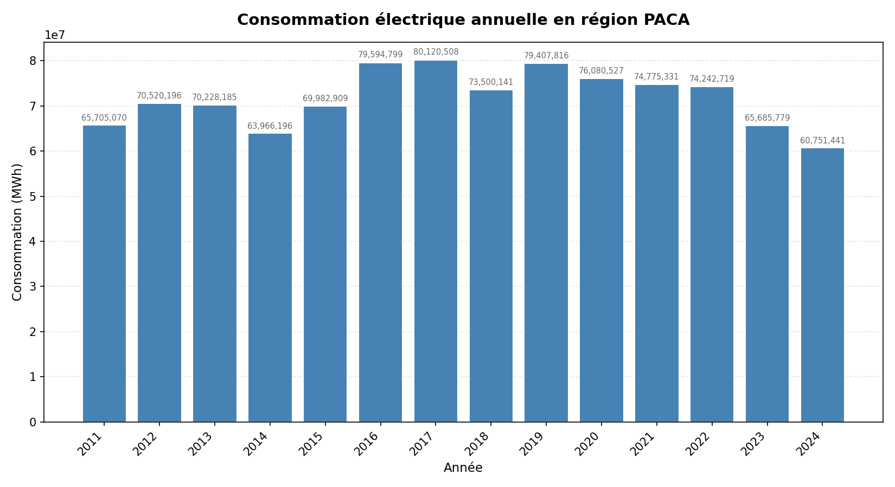
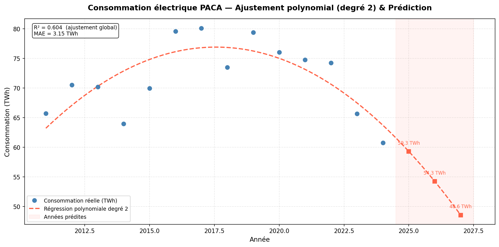

# Analyse & Prédiction de la consommation électrique en région PACA
### Analysis & Prediction of Electricity Consumption in the PACA Region

> ⚠️ **Travail personnel — © Ikram AYAD, 2025. Tous droits réservés.**
> Ce projet est un travail personnel réalisé et publié par Ikram AYAD.
> Toute reproduction, copie ou utilisation sans autorisation explicite est interdite.
>
> ⚠️ **Personal work — © Ikram AYAD, 2025. All rights reserved.**
> This project is a personal work created and published by Ikram AYAD.
> Any reproduction, copy or use without explicit permission is prohibited.

---

## 🇫🇷 Français

Projet Python en deux parties autour des données ouvertes de consommation électrique
en région PACA, illustrant une démarche Data complète :
exploration → visualisation → modélisation prédictive.

### Source des données

- **Jeu de données** : Consommation annuelle d'électricité et gaz par région
- **Fournisseur** : [data.gouv.fr](https://www.data.gouv.fr/fr/datasets/consommation-annuelle-delectricite-et-gaz-par-region/)
- **Format** : CSV (~33 500 lignes, 40 colonnes)

---

### Partie 1 — Exploration & Visualisation (`analyse_energie.py`)

#### Objectif

Charger, nettoyer et visualiser l'évolution de la consommation électrique annuelle
en PACA sur la période 2011--2024.

#### Résultat



#### Observations

- **Pic en 2016--2017** (~80 TWh) : probablement lié à des hivers rigoureux et à
  une forte part de chauffage électrique dans la région.
- **Tendance baissière depuis 2017** : cohérente avec les politiques nationales de
  sobriété énergétique et l'amélioration de l'efficacité des logements.
- **2024 au plus bas** (~60,7 TWh) : baisse de ~24% par rapport au pic de 2017.
- **2014 et 2018** : creux secondaires, potentiellement liés à des hivers doux.

#### Fonctionnalités

- Détection automatique du séparateur et du format décimal du CSV
- Identification intelligente des colonnes par mots-clés
- Nettoyage et gestion des valeurs manquantes
- Filtrage par région (paramétrable)
- Graphique à barres annoté avec export PNG automatique sur le Bureau

---

### Partie 2 — Modélisation prédictive (`prediction_energie.py`)

#### Objectif

Ajuster un modèle de **régression polynomiale de degré 2** (scikit-learn) sur les
données historiques et prédire la consommation pour 2025, 2026 et 2027.

#### Résultat



#### Méthodologie

1. Même pipeline de chargement/nettoyage que la Partie 1
2. Entraînement sur l'ensemble des 14 années disponibles
   *(un découpage train/test n'est pas adapté à une série si courte)*
3. Régression polynomiale degré 2 via un `Pipeline` scikit-learn
4. Évaluation par R² global et MAE
5. Prédiction et visualisation pour 2025--2027

#### Résultats du modèle

- **R² = 0.604** : le modèle capture 60% de la variance — cohérent, car la
  consommation dépend aussi de la météo, de l'économie et des politiques
  énergétiques qu'une seule variable temporelle ne peut pas intégrer.
- **Courbe en parabole** : bien adaptée à la forme en cloche des données
  (une droite de régression linéaire donnait un R² négatif).

---

### Installation

```bash
pip install pandas matplotlib scikit-learn
```

### Utilisation

1. Télécharger le dataset sur [data.gouv.fr](https://www.data.gouv.fr/fr/datasets/consommation-annuelle-delectricite-et-gaz-par-region/)
2. Placer le fichier `energie.csv` sur le Bureau
3. Lancer la partie souhaitée :

```bash
python analyse_energie.py      # Partie 1 - Exploration
python prediction_energie.py   # Partie 2 - Prédiction
```

### Structure du projet

```
analyse-energie-paca/
│
├── analyse_energie.py      # Partie 1 : exploration et visualisation
├── prediction_energie.py   # Partie 2 : régression polynomiale et prédiction
├── conso_paca.png          # Graphique Partie 1
├── prediction_paca.png     # Graphique Partie 2
├── .gitignore
└── README.md
```

### Compétences mobilisées

- **Python** : pandas, matplotlib, scikit-learn, numpy
- **Data** : chargement CSV, nettoyage, gestion des valeurs manquantes, agrégation
- **Machine Learning** : régression polynomiale, pipeline scikit-learn, évaluation (R², MAE)
- **Visualisation** : graphiques annotés, export PNG automatique
- **Analyse** : lecture critique de tendances sur séries temporelles

---

## 🇬🇧 English

A two-part Python project built around open electricity consumption data for the
PACA region, illustrating a complete Data workflow:
exploration → visualization → predictive modeling.

### Data Source

- **Dataset**: Annual electricity and gas consumption by region
- **Provider**: [data.gouv.fr](https://www.data.gouv.fr/fr/datasets/consommation-annuelle-delectricite-et-gaz-par-region/)
- **Format**: CSV (~33,500 rows, 40 columns)

---

### Part 1 — Exploration & Visualization (`analyse_energie.py`)

#### Objective

Load, clean and visualize the evolution of annual electricity consumption
in PACA over the 2011--2024 period.

#### Output


#### Key Findings

- **Peak in 2016--2017** (~80 TWh): likely driven by cold winters and a high share
  of electric heating in the region.
- **Downward trend since 2017**: consistent with national energy efficiency policies
  and improvements in building insulation.
- **2024 at its lowest** (~60.7 TWh): a ~24% drop compared to the 2017 peak.
- **2014 and 2018**: secondary dips, possibly linked to mild winters.

#### Features

- Automatic separator and decimal format detection
- Smart column identification using keywords
- Data cleaning and missing value handling
- Region filtering (configurable)
- Annotated bar chart with automatic PNG export to Desktop

---

### Part 2 — Predictive Modeling (`prediction_energie.py`)

#### Objective

Fit a **degree-2 polynomial regression** model (scikit-learn) on historical data
and predict electricity consumption for 2025, 2026 and 2027.

#### Output


#### Methodology

1. Same loading/cleaning pipeline as Part 1
2. Training on all 14 available years
   *(a train/test split is not suitable for such a short time series)*
3. Polynomial regression (degree 2) via a scikit-learn `Pipeline`
4. Evaluation using global R² and MAE
5. Prediction and visualization for 2025--2027

#### Model Results

- **R² = 0.604**: the model explains 60% of variance — expected, as consumption
  also depends on weather, economic activity and energy policies that a single
  time variable cannot capture.
- **Parabolic curve**: well suited to the bell-shaped data pattern
  (linear regression yielded a negative R²).

---

### Installation

```bash
pip install pandas matplotlib scikit-learn
```

### Usage

1. Download the dataset from [data.gouv.fr](https://www.data.gouv.fr/fr/datasets/consommation-annuelle-delectricite-et-gaz-par-region/)
2. Place `energie.csv` on the Desktop
3. Run whichever part you need:

```bash
python analyse_energie.py      # Part 1 - Exploration
python prediction_energie.py   # Part 2 - Prediction
```

### Project Structure

```
analyse-energie-paca/
│
├── analyse_energie.py      # Part 1: exploration and visualization
├── prediction_energie.py   # Part 2: polynomial regression and prediction
├── conso_paca.png          # Part 1 chart
├── prediction_paca.png     # Part 2 chart
├── .gitignore
└── README.md
```

### Skills Demonstrated

- **Python**: pandas, matplotlib, scikit-learn, numpy
- **Data**: CSV loading, cleaning, missing value handling, aggregation
- **Machine Learning**: polynomial regression, scikit-learn pipeline, evaluation (R², MAE)
- **Visualization**: annotated charts, automatic PNG export
- **Analysis**: critical reading of trends on time series

---

*Projet personnel — Personal project | Ikram AYAD © 2025*
